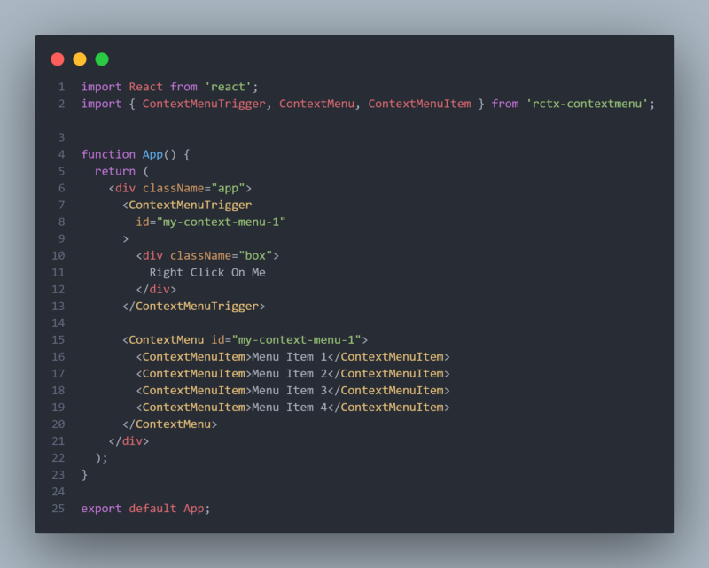
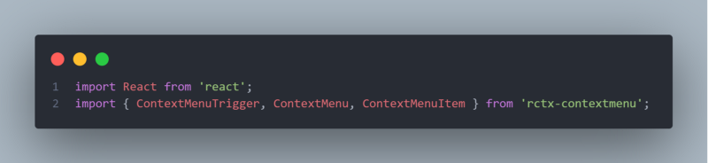
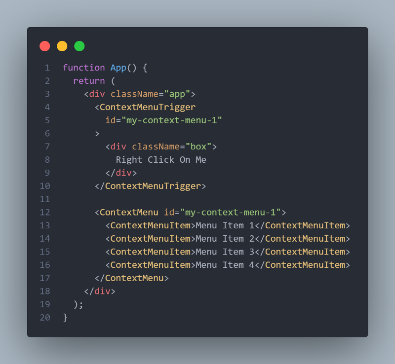
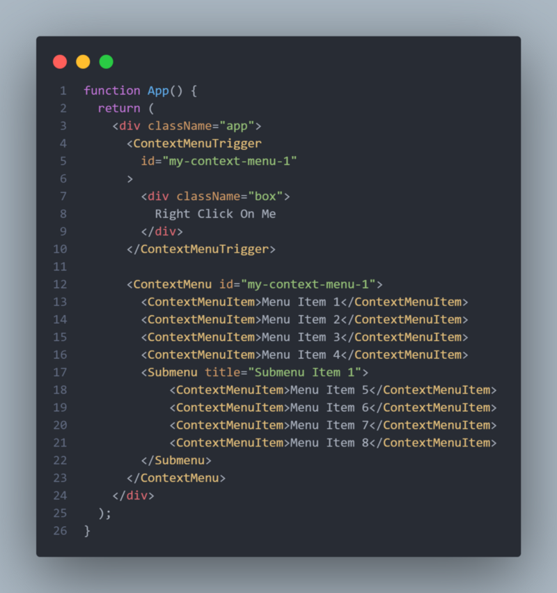

# Customize the browser Context-menu in your next React app


*Photo by Ivan Bandura / @unstable_affliction / Unsplash*

Have you ever thought of customizing native Browser Context-menu like whenever a user will right-click on any specific element you want some more options to be visible in the Context-menu? OK, that's not possible to add options or even remove options from Browser's native Context-menu. In that case, you have to use Javascript to customize the Context-menu. But that's a lot of tasks. Because you have to achieve the exact look and feel also with the Context-menu feature. Below are the things which you might need to take care if you want to use your JS code to handle the Context-menu

- Should appear on right-click
- Should appear in the mouse position of right-clicking
- Should hide on outside click of the trigger area
- Should have an option to show sub-menus
- And lastly styling part

Don't you think it's huge task for you to take care of all these things when there is a tide deadline?

---

Here comes react [rctx-contextmenu](https://www.npmjs.com/package/rctx-contextmenu) plugin in the place. So we will see how we can achieve all these things without much headache in our React application.

So there is an npm package called [rctx-contextmenu](https://www.npmjs.com/package/rctx-contextmenu) which solves Context-menu pain very easily. You have to just follow a few steps and you are in.

https://www.npmjs.com/package/rctx-contextmenu

## Installation

Run the below command to install the package first.

```
npm install rctx-contextmenu
```

## Usage

As the plugin says, in the following, there is a very basic usage code which we can use to get started



There is a lot of other APIs which this plugin offers. So I will try to explain the above code first and then will dig deep.

First of all, we are importing required packages like [React](https://reactjs.org/) and [rctx-contextmenu](https://www.npmjs.com/package/rctx-contextmenu)



Then, we are creating the `App` component and inside the `App` component there is two main components that are actually performing the Context-menu logic. One is `<ContextMenuTrigger />` and another one is `<ContextMenu />`.



There is a very essential option we will talk about is id. So the `<ContextMenu />` and `<ContextMenuTrigger />` component's id should match to work the plugin as we want.

Will come to the individual component explanation now.

---

### `<ContextMenuTrigger />`
This component actually holds the trigger area or the right-click area. We can put any kind of element inside this component as per your requirement.

### `<ContextMenu />`
This component is responsible for Context-menu items.

### `<ContextMenuItem />`
This component is responsible for each option of Context-menu. We can put any element as a child of this component.

---

Now coming to  Sub-menus. `rctx-contextmenu` Also supports sub-menus. For that, there is another component we have to use that is `<Submenu />`. Following is the code which includes sub-menus. To add `<Submenu />` we have to import `Submenu` component from `rctx-contextmenu` first. Then we can use it as the following piece of code shows.



There is a lot of other APIs which we can use. I would suggest go the [official package page](https://www.npmjs.com/package/rctx-contextmenu) or the [GitHub repo](https://github.com/reachtokish/rctx-contextmenu) and explore all the options.

https://github.com/reachtokish/rctx-contextmenu

## Conclusion

I think we have covered pretty much very basic features but there is a lot of other features that you can explore from the official plugin page.

I hope you have liked my first ever blog. If you have really liked it please do clap and share it publicly. Thanks for reading, it means a lot to me!

Let me know what your thought on this post by messaging me on [twitter](https://twitter.com/reachtokish) or [linkedin](https://www.linkedin.com/in/reachtokish/).